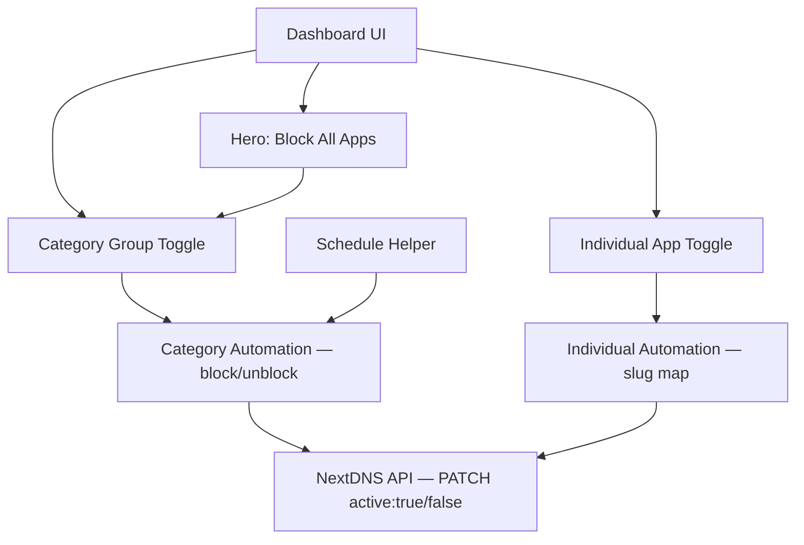

# Smarter App Blocking: NextDNS Automation in Home Assistant

> **NextDNS Home Assistant app blocking** gives you a flexible, schedule-driven parental control layer that lives entirely inside your own smart home stack — no third-party app required.

## Highlights

- All 43 NextDNS-supported services organised into 6 categories: Social Media, Messaging, Streaming, Gaming, AI & Productivity, and Dating
- A single hero button to block or unblock all apps instantly, with a three-state indicator (off / partial / all blocked)
- Per-category group toggles and per-app individual toggles — mix and match
- Schedule-based blocking per category with a visual weekly grid editor
- A clean tablet-optimised dashboard using Mushroom and Button Card
- A common YAML pitfall that silently breaks the NextDNS REST call, and exactly how to fix it
- Store the API key in `secrets.yaml` so it never ends up in version control

---

## System Overview

The setup connects four moving parts inside Home Assistant to the [NextDNS Parental Controls API](https://nextdns.github.io/api/#profile-parentalcontrol):

| Component | HA type | Purpose |
|---|---|---|
| Master + group toggles | `input_boolean` | One toggle per category plus one per app (50 total) |
| API calls | `rest_command` | PATCH requests to NextDNS `parentalcontrol/services` |
| Category automations | `automation` | 12 block/unblock automations, one pair per category |
| Individual app automations | `automation` | 2 automations covering all 43 apps via slug map |
| Scheduling | `schedule` helper | One visual weekly-grid schedule per category (6 total) |



---

## Prerequisites

- Home Assistant (any install method — OS, Container, Core)
- A [NextDNS](https://nextdns.io) account with at least one profile
- Your NextDNS **Profile ID** (visible in the profile URL: `my.nextdns.io/<profile-id>/…`)
- Your NextDNS **API key** from [my.nextdns.io/account](https://my.nextdns.io/account)

> **Security:** Never put your API key directly in `configuration.yaml` or any file that is committed to version control. Use `secrets.yaml` as shown below.

---

## Step 1 — Store the API Key Securely

Add your credentials to `secrets.yaml` (this file should be in `.gitignore`):

```yaml
# secrets.yaml
nextdns_api_key: "YOUR_API_KEY_HERE"
```

---

## Step 2 — Create the Input Boolean Helpers

The dashboard and automations rely on **50 `input_boolean` entities** — one master toggle, six category group toggles, and 43 per-app toggles covering every service NextDNS supports. Create the file `packages/nextdns/helpers.yaml` with the content below.

> All entities must exist before loading the automations or the dashboard. HA will show "does not exist" errors for any missing ones.

> **Note:** `name:` and `icon:` are intentionally omitted. HA auto-generates friendly names from entity IDs (e.g. `block_instagram` → "Block Instagram"). Adding them inside a package causes a validation error. You can set custom names and icons later via **Settings → Devices & Services → Entities**.

Copy the full file from the repository:
[**Examples/nextdns/helpers.yaml**](https://github.com/azurekid/blackcat/blob/main/Examples/nextdns/helpers.yaml)

After saving, restart Home Assistant or go to **Developer Tools → YAML → Reload helper entities (input_boolean)**.

> **Conflict warning:** If you previously defined any of these entities in `configuration.yaml` via `input_boolean: !include input_booleans.yaml`, remove that include and delete the old file — HA will error with "duplicate key" if the same entity ID exists in both places.

---

## Step 3 — Add the REST Commands

NextDNS controls app blocking via its **`parentalcontrol/services`** endpoint — not the `denylist` (which is for custom domains). Each service has a pre-defined slug (e.g., `tiktok`, `snapchat`). You PATCH it with `{"active": true}` to block and `{"active": false}` to unblock.

```yaml
# packages/nextdns/rest_commands.yaml
rest_command:
  nextdns_block_app:
    url: "https://api.nextdns.io/profiles/YOUR_PROFILE_ID/parentalcontrol/services/{{ app }}"
    method: PATCH
    headers:
      X-Api-Key: !secret nextdns_api_key
      Content-Type: "application/json"
    payload: '{"active": true}'

  nextdns_unblock_app:
    url: "https://api.nextdns.io/profiles/YOUR_PROFILE_ID/parentalcontrol/services/{{ app }}"
    method: PATCH
    headers:
      X-Api-Key: !secret nextdns_api_key
      Content-Type: "application/json"
    payload: '{"active": false}'
```

Replace `YOUR_PROFILE_ID` with your actual profile ID.

### Pitfall — YAML Block Scalars and Literal Quote Characters

Using the `>` folded-block scalar with surrounding single quotes sends those quotes as literal characters in the HTTP body:

```yaml
# Sends '{"active": true}' — literal quotes become part of the body → 400 Bad Request
payload: >
  '{"active": true}'

# Sends {"active": true} — valid JSON
payload: '{"active": true}'
```

The extra single quotes cause a `400 Bad Request` that is hard to spot because Home Assistant does not surface the response body by default. Always use an inline single-quoted string for JSON payloads.

---

## Step 4 — Create the Automations

Create the file `packages/nextdns/automations.yaml` inside your packages folder. If you haven't enabled packages yet, add this to `configuration.yaml`:

```yaml
# configuration.yaml
homeassistant:
  packages: !include_dir_named packages/
```

This single file contains all **16 automations** — one block + one unblock per category (6 pairs), a "block all" / "unblock all" pair, and individual block/unblock automations that cover all 43 apps. Every category pair triggers on **both** the manual group toggle and the corresponding schedule entity, so apps are automatically blocked and unblocked when a scheduled time window activates.

The unblock automations include a condition: they only fire when the group toggle is `off`, so a schedule window ending never overrides a block you've set manually.

> **API slugs:** Two services use slugs that differ from their entity ID suffix: `block_chatgpt` → `chatgpt`, `block_google_chat` → `google-chat` (hyphen), `block_playstation_network` → `playstation-network` (hyphen). Verify any others in your NextDNS dashboard under **Parental Controls → Services** — the slug appears in the URL when you expand a service.

Copy the full file from the repository:
[**Examples/nextdns/automations.yaml**](https://github.com/azurekid/blackcat/blob/main/Examples/nextdns/automations.yaml)

The file contains **16 automations** across three groups:

| Group | Automations | Trigger |
|---|---|---|
| Per-category block/unblock — Social, Messaging, Streaming, Gaming, AI, Dating | 12 (6 pairs) | Group toggle **or** schedule entity going `on`/`off` |
| Block/Unblock All | 2 | Master `block_all_apps` toggle |
| Individual app block/unblock | 2 | Any per-app `input_boolean` going `on`/`off` |

Two design decisions worth knowing:

- **Unblock condition:** the unblock automations only fire if the group toggle is already `off`, so an expiring schedule window never overrides a manually-set block.
- **Slug map:** the individual automations use a Jinja map to translate entity IDs to NextDNS service slugs for the two that differ (e.g. `block_google_chat` → `google-chat`).

> **Example — single category pair:**

```yaml
# packages/nextdns/automations.yaml (excerpt — Social Media)
automation:

  - id: nextdns_block_social
    alias: "NextDNS: Block Social Media"
    trigger:
      - platform: state
        entity_id: input_boolean.block_group_social
        to: "on"
      - platform: state
        entity_id: schedule.social_media_block
        to: "on"
    action:
      - service: input_boolean.turn_on
        target:
          entity_id:
            - input_boolean.block_instagram
            - input_boolean.block_facebook
            - input_boolean.block_snapchat
            - input_boolean.block_tiktok
            - input_boolean.block_messenger
            - input_boolean.block_whatsapp
      - repeat:
          for_each: [instagram, facebook, snapchat, tiktok, messenger, whatsapp]
          sequence:
            - service: rest_command.nextdns_block_app
              data:
                app: "{{ repeat.item }}"
    mode: single
```
```yaml
  - id: nextdns_unblock_social
    alias: "NextDNS: Unblock Social Media"
    trigger:
      - platform: state
        entity_id: input_boolean.block_group_social
        to: "off"
      - platform: state
        entity_id: schedule.social_media_block
        to: "off"
    condition:
      - condition: template
        value_template: >
          {{ trigger.entity_id == 'input_boolean.block_group_social'
             or is_state('input_boolean.block_group_social', 'off') }}
    action:
      - service: input_boolean.turn_off
        target:
          entity_id:
            - input_boolean.block_instagram
            - input_boolean.block_facebook
            - input_boolean.block_snapchat
            - input_boolean.block_tiktok
            - input_boolean.block_messenger
            - input_boolean.block_whatsapp
      - repeat:
          for_each: [instagram, facebook, snapchat, tiktok, messenger, whatsapp]
          sequence:
            - service: rest_command.nextdns_unblock_app
              data:
                app: "{{ repeat.item }}"
    mode: single

  # … (5 more category pairs, block_all/unblock_all, and individual block/unblock) …
  # See the full file linked above.
```

After saving, reload: **Developer Tools → YAML → Reload automations**.

---

## Step 5 — Create the Schedule Helpers

The dashboard references four `schedule.*` entities. Create them once via the UI — they do **not** exist automatically and cannot be created from YAML.

> If you skip this step, schedule cards show "Unavailable" and tapping them opens an error dialog instead of the weekly grid editor.

For **each** of the four schedules below, go to **Settings → Devices & Services → Helpers → + Create Helper → Schedule** and use the exact name listed:

| Helper name (exact) | Entity ID produced | Category |
|---|---|---|
| `social_media_block` | `schedule.social_media_block` | Social Media |
| `messaging_block` | `schedule.messaging_block` | Messaging |
| `streaming_music_block` | `schedule.streaming_music_block` | Streaming & Music |
| `gaming_block` | `schedule.gaming_block` | Gaming |
| `ai_block` | `schedule.ai_block` | AI & Productivity |
| `dating_block` | `schedule.dating_block` | Dating |

After creating a helper, tap its name in the list, then tap the **pencil icon** to draw your weekly on/off windows — for example Mon–Fri 21:00–07:00 to block every evening. The automations in Step 4 already include triggers for all six schedule entities; no additional wiring is needed.

---

## Step 6 — Tablet Dashboard (Sections Layout)

The dashboard below is built for a **tablet viewport** using Home Assistant's **Sections** view type (2024.1+). The six categories sit side-by-side in a 2-column grid across three rows — rather than one long vertical scroll.

A layered CSS gradient provides a dark space-style background with per-category ambient glow spots. Each section card uses a matching colored `box-shadow` glow so blocked and unblocked states pop visually.

### Additional HACS cards required

| Card | HACS Frontend search |
|---|---|
| `button-card` | Button Card |
| `stack-in-card` | Stack In Card |
| `card-mod` | card-mod |

> `mushroom` cards are already installed from the previous steps.

### View configuration

Copy the file below and paste its entire contents into **Edit Dashboard → Raw configuration editor** as the view entry. The `background` key uses nested radial gradients — no image file required.

[**Examples/nextdns/dashboard.yaml**](https://github.com/azurekid/blackcat/blob/main/Examples/nextdns/dashboard.yaml)


### Layout at a glance

| Row | Left column | Right column |
|---|---|---|
| Header (full-width) | Status chips + Block All hero | — |
| Row 1 | Social Media (13 apps) | Messaging (6 apps) |
| Row 2 | Streaming & Music (10 apps) | Gaming (8 apps) |
| Row 3 | AI & Productivity (5 apps) | Dating (1 app) |

> On a phone, Home Assistant automatically collapses sections to a single column, so the layout remains usable on smaller screens without changes.

---

## Step 9 — Verify the API Call

After reloading Home Assistant, test the REST command directly from **Developer Tools → Services**:

```yaml
service: rest_command.nextdns_block_app
data:
  app: snapchat
```

Check the NextDNS dashboard under **Parental Controls → Services** — Snapchat should now show as blocked. You can also verify via `curl`:

```bash
curl -s \
  -H "X-Api-Key: YOUR_API_KEY" \
  "https://api.nextdns.io/profiles/YOUR_PROFILE_ID/parentalcontrol/services/snapchat" \
  | python3 -m json.tool
```

A successful response confirms the current state:

```json
{
  "data": {
    "id": "snapchat",
    "active": true
  }
}
```

---

## Troubleshooting Reference

| Symptom | Likely cause | Fix |
|---|---|---|
| `Unknown action: rest_command.nextdns_block_app` | Name in automation doesn't match key in `configuration.yaml` | Ensure both use the exact same name — no trailing `s`, no typos |
| `400 Bad Request` from NextDNS | Payload wraps JSON in literal single quotes inside a `>` block | Use inline single-quoted string: `payload: '{"active": true}'` |
| Automation runs but nothing changes in NextDNS | Profile ID or slug is wrong | Verify the profile ID in the NextDNS dashboard URL and check each slug |
| Toggle fires but only some apps update | Slug typo in the app list | Cross-check each slug against the NextDNS Parental Controls → Services list |
| `400` on PATCH | Wrong endpoint used (`denylist` instead of `parentalcontrol/services`) | App slugs only work via `/parentalcontrol/services/{{ app }}` — `denylist` is for custom domains |

---

## Conclusion

With a handful of YAML files you now have a fully functional NextDNS-backed app-blocking system inside Home Assistant covering all 43 services NextDNS supports. Six categories, 16 automations, six schedule helpers, and a tablet-optimised dashboard — all driven by `input_boolean` entities and the NextDNS Parental Controls API.

Ready-to-use files are in the repository:
- [**Examples/nextdns/helpers.yaml**](https://github.com/azurekid/blackcat/blob/main/Examples/nextdns/helpers.yaml) — 50 `input_boolean` entities
- [**Examples/nextdns/automations.yaml**](https://github.com/azurekid/blackcat/blob/main/Examples/nextdns/automations.yaml) — 16 automations
- [**Examples/nextdns/SERVICES.md**](https://github.com/azurekid/blackcat/blob/main/Examples/nextdns/SERVICES.md) — full service reference with slugs and add/remove guides

Want to extend this further? Good next steps include:

- **Per-child profiles** — duplicate the package folder for each child, each pointing to a different NextDNS profile ID
- **Notifications** — add an `action` step that calls `notify.mobile_app_*` when a category is blocked
- **Presence-based rules** — combine with `device_tracker` to auto-apply stricter blocks when children arrive home

For a deeper look at how DNS can be leveraged from an attacker's perspective, see [DNS and Storage Enumeration Attacks in Azure](../../../Documentation/DNS-Storage-Azure-Enumeration-Attack.md) and the companion [detection guide](../../../Documentation/DNS-Storage-UAMI-Attack-Detection-Guide.md) on this blog.

**External reference:** Full API schema including the `parentalControl.services` structure is in the official [NextDNS API reference](https://nextdns.github.io/api/).

---

*Excerpt:* Block and unblock 43 apps across 6 categories on a schedule using NextDNS and Home Assistant — parental control API, group toggles, and a tablet dashboard.  
*Read time:* 8 min  
*Tags:* Home Assistant, NextDNS, Parental Controls, DNS, Automation
